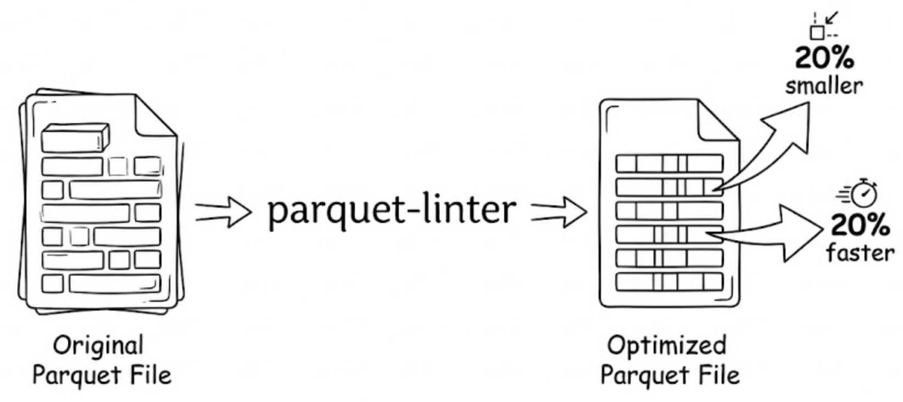

# parquet-linter

[](https://crates.io/crates/parquet-linter)
[](https://docs.rs/parquet-linter)

Unleash the performance potential of your Parquet files.



## Install

```bash
cargo install parquet-linter-cli
```

## Usage

```bash
# Lint a local file 
parquet-linter data.parquet

# Lint a remote file
parquet-linter https://huggingface.co/datasets/open-r1/OpenR1-Math-220k/resolve/main/data/train-00003-of-00010.parquet 

# Rewrite using lint results
parquet-linter rewrite data.parquet -o fixed.parquet

# Dry run 
parquet-linter rewrite data.parquet -o fixed.parquet --dry-run
```

## Prescriptions

`parquet-linter` use a little DSL (prescription) to describe what optimizations to apply:

```
set column stack_trace.list.item compression lz4_raw
set column submit_ts_ns compression uncompressed
set column next_pid compression zstd(3)
set column ts_ns dictionary_page_size_limit 2097152
set file max_row_group_size 65536
set file data_page_size_limit 1048576
```

This allows you to sample a file, and then apply the prescription to other files.

You can do this by:
```bash
parquet-linter data.parquet --export-prescription prescription.txt
```

Then apply it to another file:
```bash
parquet-linter rewrite other.parquet -o rewritten.parquet --from-prescription prescription.txt
```

### Apply at write time

You can also apply a prescription when initially writing Parquet files, avoiding a rewrite entirely. 

```rust
use parquet::file::properties::WriterProperties;
use parquet_linter::prescription::LinterPrescriptionExt;

let props = WriterProperties::builder()
    .apply_prescription("set file compression zstd(3)\nset column user_id encoding delta_binary_packed")
    .expect("valid prescription")
    .build();

// Use `props` with ArrowWriter, AsyncArrowWriter, etc.
```

## Leaderboard

We define `cost = loading_time_ms + file_size_mb`

Loading time is the time it takes to convert parquet file to arrow RecordBatch.
File size is the size of the parquet file as reported by file system.

Parquet files are listed in `doc/parquet_files.txt`. They are unmodified Parquet datasets from Hugging Face.

### Current Results

All rules enabled. Page statistics are enabled (required). Can you do better?

| | File 0 | File 1 | File 2 | File 3 | File 4 | File 5 | File 6 | **Total** |
|---|---:|---:|---:|---:|---:|---:|---:|---:|
| HuggingFace default | 468.72 | 455.16 | 415.51 | 123.32 | 449.38 | 153.06 | 646.98 | **2712.13** |
| **parquet-linter** | 475.33 (+1%) | 350.27 (-23%) | 339.17 (-18%) | 122.67 (-1%) | 345.03 (-23%) | 113.60 (-26%) | 581.58 (-10%) | **2327.66 (-14%)** |

#### Benchmark `parquet-linter`

```bash
cargo build --release --package parquet-linter-leaderboard
./target/release/parquet-leaderboard --from-linter --iterations 3
```

#### Benchmark your own prescriptions

Create a directory of numbered files (`0.prescription`, `1.prescription`, ...) matching the manifest order, then run:

```bash
./target/release/parquet-leaderboard --from-custom-prescription prescriptions --iterations 3
```


### Limitations

The current leaderboard does not show filter-pushdown results, therefore not reflecting benefits of zone maps and smaller page sizes.
